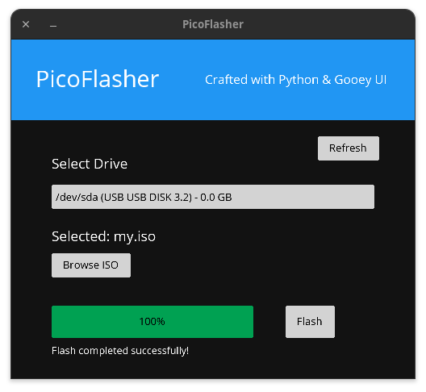

# PicoFlasher

A simple, fast, and reliable tool for creating bootable USB drives from ISO images.

## Features

- **Lightning Fast**: Optimized flashing algorithm for maximum speed
- **Safe & Secure**: Built-in safety checks prevent accidental data loss
- **Hardware Detection**: Automatically detects connected USB devices
- **Real Progress**: Live progress tracking with accurate estimates
- **Linux & Windows**: Works with all major Linux distributions and Windows ISO files
- **Simple Interface**: Clean and intuitive user interface
- **Open Source**: Completely free and open source software

## Usage

1. **Select ISO**: Click "Browse" to select your ISO file
2. **Select Device**: Choose your USB drive from the dropdown list
3. **Flash**: Click "Flash" to start the process
4. **Wait**: The progress bar will show the current status
5. **Complete**: Your bootable USB drive is ready!

## Building from Source

### Prerequisites

- Python 3.8+
- Gooey framework dependencies
